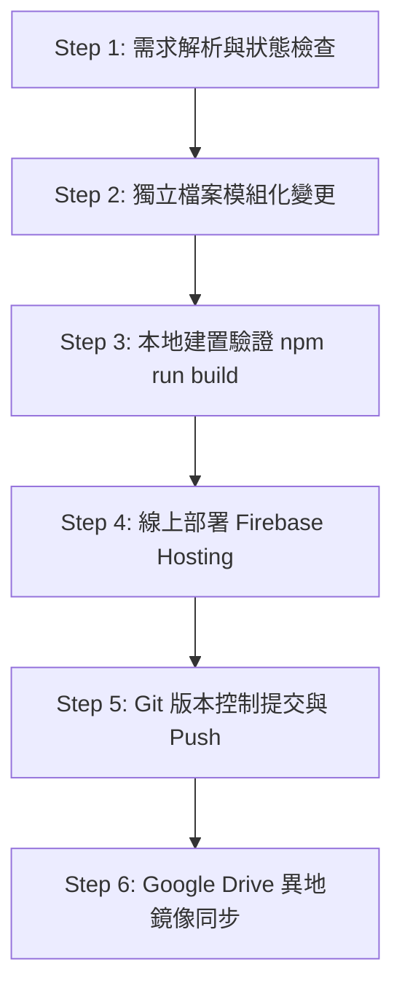

# FlashCard Pro - 觀光餐旅專業單字記憶系統：軟體設計與 Agent 開發工作流程指南

本文件記錄《FlashCard Pro - 觀光餐旅專業單字記憶系統》之軟體架構、設計規範、跨平台硬體/瀏覽器相容性處理解決方案，以及 AI Agent Pair-Programming 的完整標準作業流程（SOP）。**其他 AI Agent 可直接複製本文件內容作為開發、維護與擴充之依據。**

---

## 📌 1. 專案核心定位與業務需求 (Core Business Logic)

- **系統全稱**：`FlashCard Pro - 觀光餐旅專業單字記憶系統`
- **目標用戶**：高職/大專觀光餐旅科學生及授課教師。
- **免密碼座號選擇**：
  - 取消傳統帳號密碼與班級選擇，首頁直接提供 1 ~ 35 號座位卡片供學生點擊選擇。
  - 選擇座號後，系統永久儲存（LocalStorage + State），首頁與各關卡頂端持續顯示目前選擇之座號，返回首頁時不會重置或跑回預設值。
- **教師端防側目隱私防護**：
  - 教師端登入密碼與重要數據採取動態遮蔽與防洩漏機制，防止投影時學生看見。
- **關卡設計與簡化**：
  - 全面取消強迫拼字輸入，著重於「朗讀音訊、閃卡翻面記憶、聽力選字測驗、連連看配對大挑戰」。
- **慶祝動畫非阻塞體驗**：
  - 通關時觸發彩帶粒子 (`canvas-confetti`) 必須在 1.2 秒內自動完全消退與清理 (`confetti.reset()`)，`z-index` 不得遮擋卡片文字或點擊事件。

---

## 🛠️ 2. 技術架構與技術棧 (Tech Stack & Architecture)

- **前端框架**：Vite 6 + React 18 + TypeScript
- **UI 樣式與圖標**：Tailwind CSS + Lucide React (`lucide-react`)
- **動畫與特效**：Canvas Confetti (`canvas-confetti`)
- **聲音效果引擎**：Web Audio API 自建合成器 (`src/services/soundEffects.ts`)
- **語音朗讀系統 (TTS Architecture)**：
  - 優先嘗試瀏覽器原語音（Web Speech API `window.speechSynthesis`）。
  - 若 250ms 內未發聲或行動裝置（iOS/Android）限制，無縫切換至線上美式英語 MP3 (`https://dict.youdao.com/dictvoice?audio=...&type=2`) 與 Google TTS 備援。
  - **Autoplay 突破技術**：全站維護單一懸掛全局 `<audio id="flashcard-global-audio-player">` 元素，於使用者首訪第一次觸控時播放無聲片段 (`initAudioUnlock`)，永久解除 iOS Safari 與 Android Chrome 自動播放限制。
- **資料儲存與持久化**：
  - 本地快取：`src/services/storage.ts` (LocalStorage)
  - 雲端備份：Firebase Firestore (`src/services/firebase.ts`)
- **部署與雲端備份**：
  - **Firebase Hosting**：`https://flashcard-pro-app-25c7f.web.app`
  - **GitHub Repository**：`https://github.com/您的帳號/flashcard-pro.git`
  - **Google Drive 異地鏡像**：`h:\我的雲端硬碟\116年\AI專區\二年級記憶字卡`

---

## 📂 3. 專案目錄結構 (Directory Structure)

```
flashcard-pro/
├── .github/
│   └── workflows/              # GitHub Actions 自動化腳本
├── public/                     # 靜態資源 (favicon, icons)
├── src/
│   ├── assets/                 # 靜態圖片 (hero.png, react.svg)
│   ├── components/             # React 頁面與組件
│   │   ├── FlashcardMode.tsx    # 關卡 1：翻卡朗讀記憶
│   │   ├── LevelSelector.tsx    # 首頁：座號選擇 (1~35) 與關卡選單
│   │   ├── ListeningQuiz.tsx    # 關卡 2：聽力選字測驗
│   │   ├── LoginModal.tsx       # 教師端登入對話框
│   │   ├── MemoryMatchGame.tsx  # 關卡 3：雙語連連看配對
│   │   ├── MistakeNotebook.tsx  # 錯題本復習
│   │   ├── Navbar.tsx           # 頂部導覽列 (座號顯示、主題切換)
│   │   ├── SpellingQuiz.tsx     # 備用拼字模組
│   │   └── TeacherDashboard.tsx # 教師管理後台
│   ├── data/
│   │   └── grade2Words.ts       # 餐旅專業單字資料庫 (專業詞彙與例句)
│   ├── services/
│   │   ├── firebase.ts          # Firebase 初始化與成績上傳
│   │   ├── soundEffects.ts      # Web Audio 效果音合成器 (對、錯、通關)
│   │   ├── spacedRepetition.ts  # 間隔重複 (SuperMemo/Leitner) 演算法
│   │   ├── storage.ts           # LocalStorage 管理與座號快取
│   │   └── tts.ts               # 語音朗讀、跨平台 MP3 備援與播放器解鎖
│   ├── types/
│   │   └── index.ts             # TypeScript 型態定義 (WordItem, UserProfile)
│   ├── utils/
│   │   └── confettiHelper.ts    # 慶祝彩帶 1.2 秒自動消退輔助函式
│   ├── App.tsx                  # 應用程式主邏輯與路由狀態管理
│   ├── main.tsx                 # React 入口點
│   └── index.css                # Tailwind CSS 核心樣式
├── .firebase/                   # Firebase 暫存檔
├── firebase.json                # Firebase Hosting 設定
├── package.json                 # 專案套件依據
├── README.md                    # 專案說明文件
└── WORKFLOW.md                  # 本工作流程指南文件
```

---

## 🤖 4. AI Agent 開發與維護作業流程 (Agent Development SOP)

其他 Agent 在承接本專案或進行修改時，請嚴格遵守以下 6 個標準步驟：



### 🔹 Step 1: 需求解析與狀態檢查
- 閱讀使用者需求，確認修改範圍（例如：語音播放、UI 版面、座號記憶、關卡分數計算）。
- 檢查 `git status` 與相關組件邏輯，絕不假設變數或檔名。

### 🔹 Step 2: 獨立檔案模組化變更
- **語音修改**：至 `src/services/tts.ts`，確保使用 `initAudioUnlock()` 與 `getGlobalAudioPlayer()`。
- **動畫修改**：使用 `src/utils/confettiHelper.ts` 的 `fireCelebrationConfetti()` 與 `clearConfetti()`。
- **座號邏輯**：至 `src/services/storage.ts` 與 `src/components/LevelSelector.tsx`，保持 1~35 號連動與持久化。
- **樣式與全站標題**：全站標題必須為 `FlashCard Pro - 觀光餐旅專業單字記憶系統`。

### 🔹 Step 3: 本地建置驗證 (`npm run build`)
- 於終端機執行打包建置指令：
  ```bash
  npm run build
  ```
- 確認 TypeScript 檢查與 Vite 打包無任何錯誤（Exit code 0）。

### 🔹 Step 4: 部署至 Firebase Hosting
- 執行 Firebase 部署指令：
  ```bash
  npx --yes firebase-tools deploy --only hosting
  ```
- 確認輸出網址 `https://flashcard-pro-app-25c7f.web.app` 更新完成。

### 🔹 Step 5: Git 提交與推送到 GitHub
- 將變更加入 Git 暫存並提交：
  ```bash
  git add .
  git commit -m "feat/fix: [修復說明描述]"
  git push origin main
  ```

### 🔹 Step 6: Google Drive 異地鏡像同步
- 使用 Robocopy 自動同步至使用者的 Google Drive 專案目錄（排除產出與 Node 模組）：
  ```cmd
  robocopy "C:\flashcard-pro" "h:\我的雲端硬碟\116年\AI專區\二年級記憶字卡" /E /XD node_modules .git .firebase dist /XO
  ```

---

## 💡 5. 開發防坑與常見問題備忘錄 (Troubleshooting & Best Practices)

1. **iOS Safari / Android Chrome 無發音**：
   - 絕不能在 `setTimeout` 或非同步 callback 中重新建立 `new Audio()`，必須使用 `initAudioUnlock()` 事先解鎖全局單一 `<audio>` 標籤。
2. **彩帶遮擋畫面**：
   - 嚴禁直接呼叫原生的 `confetti({ ... })` 而不清理，必須統一調用 `fireCelebrationConfetti()`。
3. **學生座號跑掉**：
   - 使用者切換關卡或回首頁時，`App.tsx` 中的 `currentUser.seatNumber` 必須正確從 `loadUserProfile()` 讀取，不能重設為 1 號。
4. **教師密碼安全**：
   - Dashboard 與 LoginModal 中，密碼必須以遮罩隱蔽，不得裸露在 UI 或視訊畫面上。

---

## 📜 6. 擴充說明 (System Extension)

- **新增單字**：在 `src/data/grade2Words.ts` 中新增符合 `WordItem` 介面的單字物件（包含 id, word, phonetic, translation, category, level, exampleEn, exampleZh）。
- **新增主題色**：在 `src/types/index.ts` 與 `src/components/Navbar.tsx` 中定義新的 `ThemeColor` 色彩字典。
