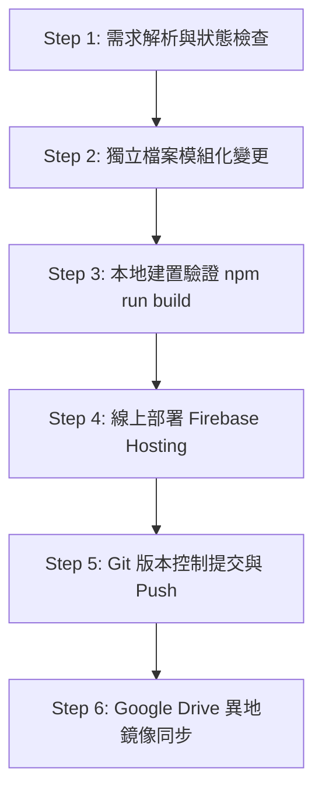

# FlashCard Pro - 觀光餐旅專業單字記憶系統：軟體設計與 Agent 開發工作流程指南

本文件記錄《FlashCard Pro - 觀光餐旅 205 班專業單字記憶系統》之軟體架構、設計規範、跨平台硬體/瀏覽器相容性處理解決方案，以及 AI Agent Pair-Programming 的完整標準作業流程（SOP）。**其他 AI Agent 可直接複製本文件內容作為開發、維護與擴充之依據。**

---

## 📌 1. 專案核心定位與業務需求 (Core Business Logic)

- **系統全稱**：`FlashCard Pro - 觀光餐旅 205 班專業單字記憶系統`
- **目標用戶**：觀光餐旅 205 班學生（1 ~ 35 號）及授課教師。
- **免密碼座號選擇與無損持久化**：
  - 首頁與登入對話框提供 01 ~ 35 號座號卡片供學生點擊切換。
  - **無損雙向合併機制 (`mergeUserProfiles`)**：比對 LocalStorage 與 Firebase Firestore 雲端資料，無縫合併最高解鎖關卡（`unlockedLevel`）、最高星星數（`stars`）、最高連續天數（`streakDays`）與各單字記憶箱位（`wordStats`），確保學生重新開啟網頁時**進度絕不被洗掉或降回第一關**。
- **排行榜真實數據**：
  - 100% 匯整全班 35 位同學的真實學習紀錄。全面移除虛構模擬資料，未登入同學顯示為初始 0 星狀態，維護英雄榜公信力。
- **極簡禪風視覺與文字簡化**：
  - 清除「靜心學習」、「艾賓浩斯」等過度複雜標語與冗餘 Chip 標籤。
  - 導覽列與首頁採用簡潔大方的 UI（`關卡`、`錯題本`、`排行榜`），打造安靜高效的學習氛圍。
- **關卡設計與自動擴充**：
  - 著重於「閃卡翻面記憶、聽力選字測驗、雙語連連看配對」。
  - 支援 CSV 匯入新單字庫時自動擴充新關卡（Unit 7, Unit 8...），同時保留歷史答題紀錄。
- **慶祝動畫非阻塞體驗**：
  - 通關彩帶粒子 (`canvas-confetti`) 於 1.2 秒內自動完全消退與清理 (`confetti.reset()`)，不遮擋點擊與操作。

---

## 🛠️ 2. 技術架構與技術棧 (Tech Stack & Architecture)

- **前端框架**：Vite 6 + React 18 + TypeScript
- **UI 樣式與圖標**：Tailwind CSS + Lucide React (`lucide-react`)
- **動畫與特效**：Canvas Confetti (`canvas-confetti`)
- **聲音效果引擎**：Web Audio API 自建合成器 (`src/services/soundEffects.ts`)
- **語音朗讀系統 (TTS Architecture)**：
  - 優先使用 Web Speech API (`window.speechSynthesis`)。
  - 行動裝置備援：無縫切換至線上美式英語 MP3 (`https://dict.youdao.com/dictvoice?audio=...&type=2`)。
  - **Autoplay 突破技術**：全站維護單一全局 `<audio id="flashcard-global-audio-player">` 元素，首訪觸控觸發 `initAudioUnlock` 播放無聲片段，永久解除 iOS Safari 與 Android Chrome 自動播放限制。
- **資料儲存與持久化**：
  - 本地快取與無損同步：`src/services/storage.ts` (`LocalStorage` + `mergeUserProfiles`)
  - 雲端備份與全班連線：Firebase Firestore (`src/services/firebase.ts`)
- **部署與雲端備份**：
  - **Firebase Hosting**：`https://flashcard-pro-app-25c7f.web.app`
  - **GitHub Repository**：`https://github.com/您的帳號/flashcard-pro.git`
  - **Google Drive 異地鏡像**：`h:\我的雲端硬碟\116年\AI專區\二年級記憶字卡`

---

## 📂 3. 專案目錄結構 (Directory Structure)

```
flashcard-pro/
├── .github/
│   └── workflows/              # GitHub Actions 自動化腳本
├── public/                     # 靜態資源 (favicon, icons)
├── src/
│   ├── assets/                 # 靜態圖片 (hero.png, react.svg)
│   ├── components/             # React 頁面與組件
│   │   ├── FlashcardMode.tsx    # 模式 1：閃卡朗讀記憶
│   │   ├── GuideModal.tsx       # 通關指南與四大原則
│   │   ├── Leaderboard.tsx      # 全班 35 位同學真實排行榜
│   │   ├── LevelSelector.tsx    # 首頁：205 班座號選擇與關卡地圖
│   │   ├── ListeningQuiz.tsx    # 模式 2：聽力選字測驗
│   │   ├── LoginModal.tsx       # 學生座號選擇與 Firebase 狀態 Modal
│   │   ├── MemoryMatchGame.tsx  # 模式 3：雙語連連看配對
│   │   ├── MistakeNotebook.tsx  # 待複習池與歷史錯題本
│   │   ├── Navbar.tsx           # 頂部導覽列 (極簡導覽、座號、星星與發音語速)
│   │   └── TeacherDashboard.tsx # 教師管理後台 (CSV 匯入/匯出與成績儀表板)
│   ├── data/
│   │   └── grade2Words.ts       # 二年級觀光餐旅專業單字庫
│   ├── services/
│   │   ├── firebase.ts          # Firebase 初始化與 Firestore 上傳/讀取
│   │   ├── soundEffects.ts      # Web Audio 效果音合成器
│   │   ├── spacedRepetition.ts  # 萊特納間隔重複演算法
│   │   ├── storage.ts           # LocalStorage 管理與 mergeUserProfiles 無損合併
│   │   └── tts.ts               # 語音朗讀、跨平台 MP3 備援與解鎖
│   ├── types/
│   │   └── index.ts             # TypeScript 型態定義 (WordItem, UserProfile, 205班)
│   ├── utils/
│   │   ├── confettiHelper.ts    # 慶祝彩帶 1.2 秒自動消退輔助函式
│   │   └── csvHelper.ts         # CSV 單字表格匯入/匯出解析器
│   ├── App.tsx                  # 應用程式主邏輯、狀態初始化與雙向同步
│   ├── main.tsx                 # React 入口點
│   └── index.css                # Tailwind CSS 核心樣式與極簡禪風卡片樣式
├── index.html                   # HTML 入口
├── firebase.json                # Firebase Hosting 設定
├── package.json                 # 專案套件依據
├── README.md                    # 專案說明文件
└── WORKFLOW.md                  # 本工作流程指南文件
```

---

## 🤖 4. AI Agent 開發與維護作業流程 (Agent Development SOP)

其他 Agent 在承接本專案或進行修改時，請嚴格遵守以下 6 個標準步驟：



### 🔹 Step 1: 需求解析與狀態檢查
- 閱讀使用者需求，確認修改範圍（例如：語音播放、進度持久化、UI 版面、排行榜邏輯）。
- 檢查 `git status` 與相關組件邏輯，絕不假設變數或檔名。

### 🔹 Step 2: 獨立檔案模組化變更
- **進度記憶修改**：於 `src/services/storage.ts` 與 `src/App.tsx` 使用 `mergeUserProfiles` 進行無損合併。
- **排行榜修改**：於 `src/components/Leaderboard.tsx` 確保讀取真實分數，禁絕產生虛構數據。
- **語音修改**：至 `src/services/tts.ts`，確保使用 `initAudioUnlock()` 與 `getGlobalAudioPlayer()`。
- **動畫修改**：使用 `src/utils/confettiHelper.ts` 的 `fireCelebrationConfetti()` 與 `clearConfetti()`。
- **班級標示**：預設班級全數標示為 **`205 班`**。

### 🔹 Step 3: 本地建置驗證 (`npm run build`)
- 於終端機執行打包建置指令：
  ```bash
  npm run build
  ```
- 確認 TypeScript 檢查與 Vite 打包無任何錯誤（Exit code 0）。

### 🔹 Step 4: 部署至 Firebase Hosting
- 執行 Firebase 部署指令：
  ```bash
  npx --yes firebase-tools deploy --only hosting
  ```
- 確認輸出網址 `https://flashcard-pro-app-25c7f.web.app` 更新完成。

### 🔹 Step 5: Git 提交與推送到 GitHub
- 將變更加入 Git 暫存並提交：
  ```bash
  git add .
  git commit -m "feat/fix: [修復說明描述]"
  git push origin main
  ```

### 🔹 Step 6: Google Drive 異地鏡像同步
- 使用 Robocopy 自動同步至使用者的 Google Drive 專案目錄（排除產出與 Node 模組）：
  ```cmd
  robocopy "C:\flashcard-pro" "h:\我的雲端硬碟\116年\AI專區\二年級記憶字卡" /E /XD node_modules .git .firebase dist /XO
  ```

---

## 💡 5. 開發防坑與常見問題備忘錄 (Troubleshooting & Best Practices)

1. **座號進度掉關卡或被重置**：
   - 絕不能用非同步回傳的單一 Snapshot 直接覆寫 `userProfile`。必須經過 `mergeUserProfiles(local, remote)` 合併兩者最大進度與解鎖關卡。
2. **排行榜出現不真實分數**：
   - 嚴禁於 `Leaderboard.tsx` 使用隨機 Pseudo Data。無紀錄座號一律顯示 0 星與未開始。
3. **iOS Safari / Android Chrome 無發音**：
   - 絕不能在 `setTimeout` 或非同步 callback 中重新建立 `new Audio()`，必須使用 `initAudioUnlock()` 事先解鎖全局單一 `<audio>` 標籤。
4. **彩帶遮擋畫面**：
   - 嚴禁直接呼叫原生的 `confetti({ ... })` 而不清理，必須統一調用 `fireCelebrationConfetti()`。
5. **教師密碼安全**：
   - Dashboard 與 LoginModal 中，密碼必須以遮罩隱蔽，不得裸露在 UI 或視訊畫面上。

---

## 📜 6. 擴充說明 (System Extension)

- **新增單字與關卡**：在 `src/data/grade2Words.ts` 或透過教師後台 CSV 匯入單字。系統自動支援拓展 Unit 7, Unit 8 等全新關卡。
- **新增主題色**：在 `src/types/index.ts` 與 `src/components/Navbar.tsx` 中定義新的 `ThemeColor` 色彩字典。
